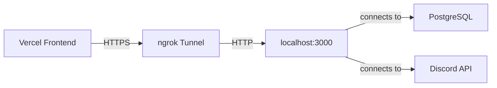

# 🚀 Connect Vercel Frontend to Local Backend

This guide explains how to connect your Vercel-deployed frontend to your localhost backend.

## 🎯 Overview

Your setup:
- **Frontend**: Deployed on Vercel (production)
- **Backend**: Running locally on `localhost:3000` (Docker)
- **Database**: Running locally (Docker)
- **Discord Bot**: Running in backend container

## 📋 Prerequisites

1. ✅ Backend running locally: `docker-compose -f docker-compose.local.yml up -d`
2. ✅ Database running and healthy
3. ✅ ngrok account (free): https://dashboard.ngrok.com/signup

---

## 🔧 Step 1: Install & Setup ngrok

### Option A: Download Binary
1. Download from: https://ngrok.com/download
2. Extract and add to PATH
3. Get your authtoken from: https://dashboard.ngrok.com/get-started/your-authtoken
4. Run: `ngrok config add-authtoken YOUR_TOKEN`

### Option B: Package Manager
```powershell
# Using Chocolatey
choco install ngrok

# Using Scoop
scoop install ngrok

# Then authenticate
ngrok config add-authtoken YOUR_TOKEN
```

---

## 🌐 Step 2: Start ngrok Tunnel

Run the provided script:
```powershell
.\setup-ngrok.ps1
```

Or manually:
```powershell
ngrok http 3000
```

You'll see something like:
```
Forwarding   https://abc123.ngrok-free.app -> http://localhost:3000
```

**📝 Copy the HTTPS URL** (e.g., `https://abc123.ngrok-free.app`)

---

## 🔐 Step 3: Update Backend CORS

1. Open your `.env` file
2. Add your ngrok URL to `CORS_ORIGIN`:

```env
CORS_ORIGIN=https://www.btecgenerator.page,https://btec-generator-git-main-raximnuraliyevs-projects.vercel.app,http://localhost:5173,https://YOUR_NGROK_URL.ngrok-free.app
```

3. Restart the backend:
```powershell
docker-compose -f docker-compose.local.yml restart backend
```

---

## ☁️ Step 4: Configure Vercel

### Add Environment Variable

1. Go to your Vercel project: https://vercel.com/dashboard
2. Select your project → **Settings** → **Environment Variables**
3. Add a new variable:
   - **Key**: `VITE_API_URL`
   - **Value**: `https://YOUR_NGROK_URL.ngrok-free.app`
   - **Environment**: Production, Preview, Development (select all)

### Redeploy

1. Go to **Deployments** tab
2. Click **︙** on latest deployment → **Redeploy**
3. Wait for deployment to complete

---

## ✅ Step 5: Verify Connection

### Test Backend
```powershell
# Test ngrok tunnel
curl https://YOUR_NGROK_URL.ngrok-free.app/api/health

# Should return: {"status":"ok"}
```

### Test Frontend
1. Open your Vercel app: `https://btec-generator-git-main-raximnuraliyevs-projects.vercel.app`
2. Try to log in or register
3. Check browser console for any errors

### Check Discord Bot
```powershell
docker-compose -f docker-compose.local.yml logs backend | Select-String "DISCORD"
```

You should see:
```
[DISCORD_BOT] Logged in as YourBot#1234
[DISCORD_BOT] Admin channel connected: your-channel
```

---

## 🔄 Complete Setup Flow



---

## 🐛 Troubleshooting

### Discord Bot Not Starting

**Problem**: Bot says "No token provided"
```
[DISCORD_BOT] DISCORD_TOKEN not set, bot will not start
```

**Solution**: Check your `.env` file has `DISCORD_TOKEN` (not `DISCORD_BOT_TOKEN`):
```env
DISCORD_TOKEN=MTQ1MTIyMTM0Mjk0NTgwODQ0OA.GG2_gS...
```

Then restart:
```powershell
docker-compose -f docker-compose.local.yml restart backend
```

---

### Vercel Can't Connect

**Problem**: Frontend shows "Network Error" or CORS errors

**Solutions**:
1. ✅ Verify ngrok is running: `curl https://YOUR_NGROK_URL.ngrok-free.app/api/health`
2. ✅ Check CORS_ORIGIN in `.env` includes ngrok URL
3. ✅ Verify `VITE_API_URL` is set in Vercel environment variables
4. ✅ Redeploy Vercel after adding environment variables

---

### Database Connection Issues

**Problem**: Backend can't connect to database

**Solution**: Make sure postgres is healthy:
```powershell
docker-compose -f docker-compose.local.yml ps

# Should show postgres as "healthy"
```

If not, rebuild:
```powershell
docker-compose -f docker-compose.local.yml down
docker-compose -f docker-compose.local.yml up -d --build
```

---

## 🎯 Quick Reference

### Start Everything
```powershell
# Start backend + database
docker-compose -f docker-compose.local.yml up -d

# Start ngrok tunnel
.\setup-ngrok.ps1
# OR
ngrok http 3000
```

### Stop Everything
```powershell
# Stop ngrok: Ctrl+C in ngrok terminal

# Stop backend + database
docker-compose -f docker-compose.local.yml down
```

### View Logs
```powershell
# Backend logs
docker-compose -f docker-compose.local.yml logs -f backend

# Database logs
docker-compose -f docker-compose.local.yml logs -f postgres

# All logs
docker-compose -f docker-compose.local.yml logs -f
```

---

## 📱 Alternative: Local Frontend

If you want to run the frontend locally instead of using Vercel:

```powershell
# Install dependencies
npm install

# Start dev server
npm run dev

# Frontend will be at http://localhost:5173
# It will automatically proxy API calls to localhost:3000
```

---

## 🔒 Security Notes

⚠️ **Important**: ngrok free tier URLs are public! Anyone with the URL can access your backend.

For production:
- Use a proper VPS or cloud hosting
- Set up proper authentication
- Use environment-specific secrets
- Never commit `.env` files to git

---

## 📚 Resources

- ngrok Documentation: https://ngrok.com/docs
- Vercel Environment Variables: https://vercel.com/docs/environment-variables
- Discord.js Guide: https://discordjs.guide/
- Prisma Docs: https://www.prisma.io/docs

---

## ✨ Summary

✅ Backend running on localhost:3000  
✅ Database running on localhost:5432  
✅ ngrok exposing backend to internet  
✅ Vercel frontend connected via ngrok  
✅ Discord bot running in backend container  

You're all set! 🎉
